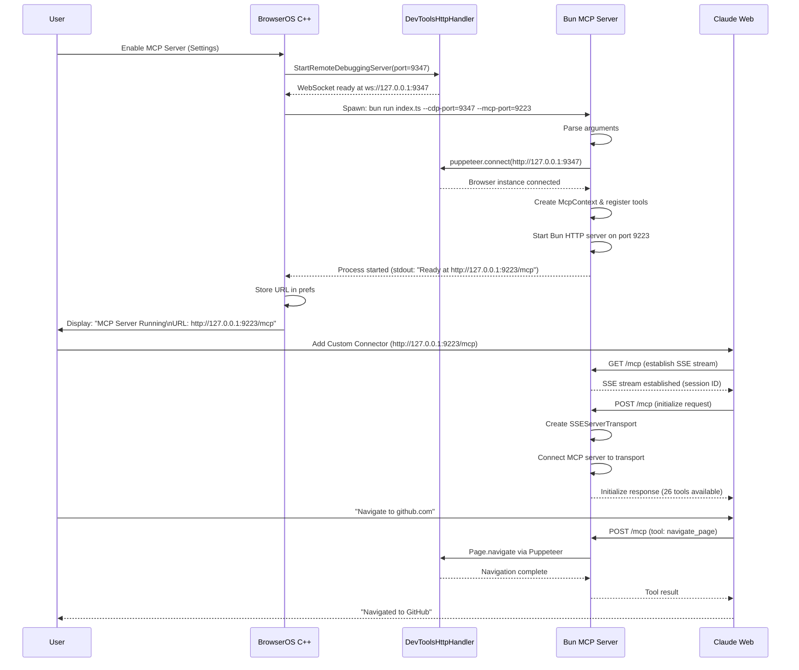

# BrowserOS MCP Server - Transformation Design

## Overview

Transform `chrome-devtools-mcp` from a CLI-spawned subprocess server (STDIO transport) to a standalone HTTP MCP server that connects to an externally-managed Chrome/BrowserOS instance via CDP WebSocket.

### Current State

- **Purpose**: CLI tool that launches/connects to Chrome and exposes CDP via MCP
- **Transport**: STDIO (stdin/stdout) - launched by Claude Desktop as subprocess
- **Browser Management**: Server launches Chrome OR connects to existing instance
- **Arguments**: Complex CLI with ~10 options (browserUrl, headless, channel, etc.)
- **Runtime**: Node.js
- **Target Users**: Developers running local Claude Desktop

### Target State

- **Purpose**: HTTP MCP server for BrowserOS integration
- **Transport**: HTTP with SSE (Server-Sent Events)
- **Browser Management**: ALWAYS connects to existing CDP (never launches)
- **Arguments**: ONLY 2: `--cdp-port=<port>` and `--mcp-port=<port>`
- **Runtime**: Bun (fast startup, native TypeScript)
- **Target Users**: BrowserOS users accessing via Claude web, ChatGPT, etc.

---

## Architecture

### High-Level Flow

```
┌─────────────────────────────────────────────────────────┐
│ BrowserOS C++ (MCPServerManager)                        │
│                                                         │
│  1. User enables "MCP Server" in settings              │
│  2. Start DevToolsHttpHandler on random port (9347)    │
│     → ws://127.0.0.1:9347                              │
│  3. Spawn Bun process:                                 │
│     bun run index.ts --cdp-port=9347 --mcp-port=9223   │
│  4. Store MCP URL for UI:                              │
│     http://127.0.0.1:9223/mcp                          │
└─────────────────────────────────────────────────────────┘
                           ↓
┌─────────────────────────────────────────────────────────┐
│ Bun Process (src/main.ts - TRANSFORMED)                 │
│                                                         │
│  ┌──────────────────────────────────────────────────┐ │
│  │ Argument Parsing                                 │ │
│  │  • Parse: --cdp-port=<port>                      │ │
│  │  • Parse: --mcp-port=<port>                      │ │
│  │  • Validate both are valid integers              │ │
│  │  • Exit with error if missing/invalid            │ │
│  └──────────────────────────────────────────────────┘ │
│                           ↓                             │
│  ┌──────────────────────────────────────────────────┐ │
│  │ CDP Connection via Puppeteer                     │ │
│  │  • Connect to: http://127.0.0.1:${cdpPort}       │ │
│  │  • No browser launch logic                       │ │
│  │  • Exit with error if connection fails           │ │
│  └──────────────────────────────────────────────────┘ │
│                           ↓                             │
│  ┌──────────────────────────────────────────────────┐ │
│  │ MCP Server Initialization                        │ │
│  │  • Create McpContext from browser                │ │
│  │  • Register all 26 tools (keep existing logic)   │ │
│  │  • Tools: navigate, screenshot, console, etc.    │ │
│  └──────────────────────────────────────────────────┘ │
│                           ↓                             │
│  ┌──────────────────────────────────────────────────┐ │
│  │ HTTP Server (Bun.serve)                          │ │
│  │  • Endpoint: GET /mcp → SSE stream               │ │
│  │  • Endpoint: POST /mcp → MCP messages            │ │
│  │  • Session management via SSEServerTransport     │ │
│  │  • Listen on: http://127.0.0.1:${mcpPort}        │ │
│  └──────────────────────────────────────────────────┘ │
└─────────────────────────────────────────────────────────┘
                           ↑ HTTP/SSE
┌─────────────────────────────────────────────────────────┐
│ MCP Clients                                             │
│  • Claude Web (claude.ai)                               │
│  • ChatGPT Desktop                                      │
│  • Custom MCP clients                                   │
│                                                         │
│  Connect to: http://127.0.0.1:9223/mcp                 │
└─────────────────────────────────────────────────────────┘
```

### Component Interactions



---

## Features Breakdown

### Feature 1: Argument Parsing

**Purpose**: Accept only 2 required arguments from C++ spawner

**Requirements**:

- Parse `--cdp-port=<number>` argument
- Parse `--mcp-port=<number>` argument
- Validate both are present
- Validate both are valid integers (1-65535)
- Exit with clear error message if validation fails
- Remove all existing yargs-based CLI parsing
- Remove support for all other arguments (browserUrl, headless, channel, etc.)

**Success Criteria**:

- Server starts only with both valid ports
- Clear error messages for missing/invalid ports
- No other arguments accepted

---

### Feature 2: CDP Connection (Connect-Only)

**Purpose**: Connect to externally-managed browser via Puppeteer

**Requirements**:

- Use `puppeteer.connect()` with `browserURL: http://127.0.0.1:${cdpPort}`
- Remove all browser launching logic (`puppeteer.launch()`)
- Remove browser lifecycle management (no launch, no shutdown)
- Set `defaultViewport: null` (preserve browser viewport)
- Use existing `targetFilter` from browser.ts
- Handle connection failures gracefully
- Exit with error code if CDP connection fails
- Log connection success with CDP port

**Success Criteria**:

- Connects to existing Chrome/BrowserOS instance
- Fails fast with clear error if browser not available
- No browser launch code remains

---

### Feature 3: MCP Server with Tools

**Purpose**: Expose all 26 chrome-devtools-mcp tools via MCP protocol

**Requirements**:

- Create `McpServer` instance with name/version
- Create `McpContext` from connected browser
- Register all existing tools (no changes to tool logic):
  - Console tools (get_console_logs, clear_console, etc.)
  - Emulation tools (set_device_metrics, etc.)
  - Input tools (click_element, type_text, etc.)
  - Network tools (get_network_logs, etc.)
  - Pages tools (navigate_page, get_page_content, etc.)
  - Performance tools (start_performance_trace, etc.)
  - Screenshot tools (take_screenshot, etc.)
  - Script tools (execute_script, etc.)
  - Snapshot tools (capture_snapshot, etc.)
- Use existing tool registration loop
- Preserve existing tool mutex for serialization
- Keep existing error handling per tool

**Success Criteria**:

- All 26 tools available to MCP clients
- Tool execution works identically to current implementation
- No regression in tool functionality

---

### Feature 4: HTTP Server with SSE Transport

**Purpose**: Expose MCP server via HTTP using Bun native HTTP

**Requirements**:

- Use `Bun.serve()` for HTTP server
- Bind to `127.0.0.1:${mcpPort}` (localhost only)
- Implement SSE transport integration:
  - GET /mcp → Establish SSE stream
  - POST /mcp → Handle MCP JSON-RPC messages
- Session management:
  - Store transports by session ID
  - Extract session ID from query params
  - Clean up closed sessions
- Request handling:
  - Parse JSON body for POST requests
  - Forward to `SSEServerTransport.handlePostMessage()`
  - Handle errors with appropriate HTTP status codes
- Logging:
  - Can use `console.log()` (not STDIO transport)
  - Log server startup with URL
  - Log SSE connections/disconnections
  - Log errors

**Technical Details**:

- Use `@modelcontextprotocol/sdk/server/sse.js` for `SSEServerTransport`
- Adapt Bun native HTTP to work with Node.js-based SSEServerTransport
- Handle conversion between Bun Request/Response and Node.js equivalents
- Session cleanup on transport close

**Success Criteria**:

- HTTP server responds on configured port
- Multiple MCP clients can connect simultaneously
- SSE streams remain open for notifications
- POST messages routed to correct session
- Clean shutdown on SIGINT

---

### Feature 5: Error Handling & Exit Strategy

**Purpose**: Fail fast with clear errors, let C++ handle recovery

**Requirements**:

- **Argument errors**: Exit code 1, stderr message
  - "Error: Missing required argument --cdp-port"
  - "Error: Missing required argument --mcp-port"
  - "Error: Invalid port number for --cdp-port: <value>"
  - "Error: Invalid port number for --mcp-port: <value>"
- **CDP connection errors**: Exit code 2, stderr message
  - "Error: Failed to connect to CDP at http://127.0.0.1:<port>"
  - Include underlying error message
- **Port binding errors**: Exit code 3, stderr message
  - "Error: Failed to bind HTTP server on port <port>"
  - "Error: Port <port> already in use"
- **Graceful shutdown**: Exit code 0
  - Close all SSE transports
  - Close CDP connection
  - Log "Server shutdown complete"
- **No retry logic**: Exit immediately on errors
- **No process monitoring**: C++ code handles restart

**Success Criteria**:

- Clear error messages on stderr
- Distinct exit codes for different failures
- C++ can detect failure type from exit code
- No hanging processes

---

### Feature 6: Logging & Output

**Purpose**: Provide visibility into server operation

**Requirements**:

- Startup logs (stdout):
  - "BrowserOS MCP Server v<version>"
  - "Connected to CDP at http://127.0.0.1:<cdpPort>"
  - "MCP Server ready at http://127.0.0.1:<mcpPort>/mcp"
- Connection logs:
  - "SSE connection established: session <id>"
  - "SSE connection closed: session <id>"
- Tool execution logs:
  - "<tool_name> request: <params>" (keep existing logger)
  - Keep existing debug logs via `debug` package
- Error logs (stderr):
  - All errors before exit
  - Tool execution errors (already logged)
- Shutdown logs:
  - "Shutting down server..."
  - "Closing <N> active sessions"
  - "Server shutdown complete"

**Success Criteria**:

- Clear visibility into server state
- Easy debugging via logs
- No STDIO protocol corruption (HTTP transport)

---

## Tasks Breakdown

### Phase 1: Code Removal & Simplification

#### Task 1.1: Remove Browser Launch Logic

**Files**: `src/browser.ts`, `src/main.ts`

- Delete `launch()` function from browser.ts
- Delete `ensureBrowserLaunched()` function
- Remove all LaunchOptions types
- Remove executablePath, channel, headless, isolated, userDataDir logic
- Keep only `ensureBrowserConnected()` function
- Remove browser process management (stderr/stdout piping)
- Remove profile directory creation

#### Task 1.2: Remove Complex CLI Parsing

**Files**: `src/cli.ts`, `src/main.ts`

- Delete entire `src/cli.ts` file
- Remove yargs dependency usage
- Remove all cliOptions definitions
- Remove parseArguments function
- Create simple argument parser for 2 args only

#### Task 1.3: Remove STDIO Transport Code

**Files**: `src/main.ts`

- Remove `StdioServerTransport` import
- Remove transport initialization
- Remove server.connect(transport) for STDIO
- Keep server initialization logic

---

### Phase 2: New Argument Parsing

#### Task 2.1: Create Simple Argument Parser

**Files**: `src/args.ts` (new file)

- Function: `parseArgs(): { cdpPort: number; mcpPort: number }`
- Parse `process.argv` manually
- Look for `--cdp-port=<value>` pattern
- Look for `--mcp-port=<value>` pattern
- Validate both present
- Validate both are numbers
- Exit with error code 1 if invalid
- Return validated ports

#### Task 2.2: Integrate Argument Parser

**Files**: `src/main.ts`

- Import parseArgs from args.ts
- Call at startup
- Use returned ports
- Remove all other arg handling

---

### Phase 3: CDP Connection Refactoring

#### Task 3.1: Simplify Browser Connection

**Files**: `src/browser.ts`

- Keep only `ensureBrowserConnected(browserURL: string)` function
- Remove conditional logic (always connect, never launch)
- Simplify error handling
- Remove isolated/userDataDir params
- Remove logFile param
- Remove viewport param

#### Task 3.2: Update Main Connection Logic

**Files**: `src/main.ts`

- Remove `getContext()` complexity
- Direct call: `ensureBrowserConnected(`http://127.0.0.1:${cdpPort}`)`
- Handle connection errors
- Exit with code 2 on CDP failure
- Log successful connection

---

### Phase 4: HTTP Server Implementation

#### Task 4.1: Create Bun HTTP Adapter for SSEServerTransport

**Files**: `src/http-server.ts` (new file)

- Import `SSEServerTransport` from MCP SDK
- Create Bun-compatible wrapper
- Convert Bun Request → Node.js IncomingMessage
- Convert Bun Response → Node.js ServerResponse
- Handle streaming for SSE
- Handle JSON parsing for POST
- Session storage Map

#### Task 4.2: Implement Request Router

**Files**: `src/http-server.ts`

- Route: `GET /mcp` → Create new SSE transport
- Route: `POST /mcp` → Forward to existing transport
- Extract session ID from query params
- Return 404 for unknown sessions
- Return 400 for malformed requests
- Return 500 for internal errors

#### Task 4.3: Implement Session Management

**Files**: `src/http-server.ts`

- Map: `sessionId → SSEServerTransport`
- On transport.onclose → Remove from map
- Cleanup on server shutdown
- Log session lifecycle

#### Task 4.4: Create Bun Server Instance

**Files**: `src/main.ts`

- Use `Bun.serve()` instead of express
- Bind to `127.0.0.1:${mcpPort}`
- Integrate request router
- Handle port binding errors
- Exit with code 3 on bind failure

---

### Phase 5: MCP Server Integration

#### Task 5.1: Connect MCP Server to HTTP Transport

**Files**: `src/main.ts`

- Keep existing McpServer initialization
- Keep existing tool registration
- For each SSE connection:
  - Create new McpServer instance OR reuse
  - Connect to SSEServerTransport
  - Handle initialization

#### Task 5.2: Preserve Tool Registration

**Files**: No changes to `src/tools/` directory

- Keep all 26 tools unchanged
- Keep tool mutex
- Keep tool execution logic
- Keep error handling per tool

---

### Phase 6: Error Handling & Logging

#### Task 6.1: Implement Error Exit Strategy

**Files**: `src/main.ts`, `src/args.ts`, `src/http-server.ts`

- Argument errors → Exit code 1
- CDP errors → Exit code 2
- HTTP bind errors → Exit code 3
- All errors to stderr
- Clear error messages

#### Task 6.2: Add Startup Logging

**Files**: `src/main.ts`

- Log version
- Log CDP connection URL
- Log MCP server URL
- Use stdout (safe with HTTP transport)

#### Task 6.3: Add Connection Logging

**Files**: `src/http-server.ts`

- Log SSE connections
- Log session IDs
- Log disconnections
- Use existing logger utility

#### Task 6.4: Implement Graceful Shutdown

**Files**: `src/main.ts`

- Listen for SIGINT
- Close all transports
- Close HTTP server
- Close browser connection
- Log shutdown
- Exit code 0

---

### Phase 7: Cleanup & Polish

#### Task 7.1: Update Dependencies

**Files**: `package.json`

- Keep: `@modelcontextprotocol/sdk`, `puppeteer-core`, `debug`
- Remove: `yargs` (no longer needed)
- Keep dev dependencies as-is
- Update engine to require Bun (optional)

#### Task 7.2: Update Build Scripts

**Files**: `package.json`

- Keep TypeScript compilation
- Ensure Bun compatibility
- Test with `bun run build`

#### Task 7.3: Remove Unused Files

**Files**: Various

- Delete `src/cli.ts`
- Delete unused browser launch code
- Keep all tool files
- Keep McpContext
- Keep McpResponse

#### Task 7.4: Update Type Definitions

**Files**: `src/browser.ts`, `src/main.ts`

- Remove unused types
- Update function signatures
- Remove complex option types
- Keep tool-related types

---

### Phase 8: Testing & Validation

#### Task 8.1: Manual Testing - Argument Parsing

- Test missing --cdp-port → Exit code 1
- Test missing --mcp-port → Exit code 1
- Test invalid port values → Exit code 1
- Test valid ports → Server starts

#### Task 8.2: Manual Testing - CDP Connection

- Test with browser running → Connection success
- Test without browser → Exit code 2
- Test with wrong port → Exit code 2
- Verify error messages

#### Task 8.3: Manual Testing - HTTP Server

- Test GET /mcp → SSE stream established
- Test POST /mcp → Message handled
- Test invalid session ID → 404
- Test port already in use → Exit code 3

#### Task 8.4: Manual Testing - MCP Client Connection

- Connect from Claude web
- Verify 26 tools appear
- Test navigate_page tool
- Test screenshot tool
- Test console tools
- Verify tool execution works

#### Task 8.5: Manual Testing - Multi-Client

- Connect 2 clients simultaneously
- Verify separate sessions
- Test tool calls from both
- Verify no cross-session issues

#### Task 8.6: Manual Testing - Shutdown

- Test Ctrl+C shutdown
- Verify sessions closed
- Verify clean exit
- Verify browser stays running

---

## Technical Decisions

### Decision 1: Bun vs Express

**Choice**: Bun native HTTP (`Bun.serve()`)
**Rationale**:

- Faster startup time critical for C++ spawned process
- Native TypeScript support (no transpilation needed)
- Simpler dependency tree
- Built-in JSON parsing
- Better performance for CDP proxy use case
  **Trade-offs**:
- Need to adapt Node.js-based SSEServerTransport
- Less mature ecosystem
- Requires conversion layer for IncomingMessage/ServerResponse

### Decision 2: Single /mcp Endpoint

**Choice**: Both GET and POST to `/mcp`
**Rationale**:

- Matches modern MCP SDK examples
- Simpler than separate endpoints
- Semantic clarity
- Easier client configuration
  **Trade-offs**:
- Need to distinguish GET vs POST in handler
- Session management in query params

### Decision 3: Session Management

**Choice**: Store transports in Map, cleanup on close
**Rationale**:

- Matches MCP SDK examples
- Simple and effective
- No external state store needed
- Works with single-process model
  **Trade-offs**:
- Sessions lost on server restart
- No persistence across restarts
- Acceptable for BrowserOS use case (C++ manages lifecycle)

### Decision 4: Error Handling Strategy

**Choice**: Fail fast, distinct exit codes, let C++ retry
**Rationale**:

- Clear separation of concerns
- C++ has better context for retry logic
- Simpler Bun process
- Easier debugging
- Matches design doc philosophy
  **Trade-offs**:
- No built-in resilience
- Depends on C++ reliability
- Acceptable trade-off for managed environment

### Decision 5: Logging Strategy

**Choice**: Simple console.log to stdout/stderr
**Rationale**:

- HTTP transport doesn't corrupt STDIO
- Easy to capture by C++ parent
- No complex logging library needed
- Clear separation: stdout=info, stderr=errors
- Good enough for debugging
  **Trade-offs**:
- No structured logging
- No log rotation
- No log levels
- Can add later if needed

### Decision 6: Code Reuse

**Choice**: Keep all 26 tools unchanged, reuse McpContext
**Rationale**:

- Zero regression risk for tool logic
- Proven and tested code
- Faster implementation
- Only change transport layer
  **Trade-offs**:
- Some dead code remains (browser launch logic in browser.ts)
- Clean up in future refactor

---

## File Structure Changes

### New Files

```
src/
  args.ts           # Simple 2-arg parser
  http-server.ts    # Bun HTTP + SSE transport adapter
```

### Modified Files

```
src/
  main.ts           # Remove CLI, STDIO transport; Add HTTP server
  browser.ts        # Simplify to connect-only
```

### Deleted Files

```
src/
  cli.ts            # Remove yargs-based CLI
```

### Unchanged Files

```
src/
  tools/            # All 26 tools - NO CHANGES
  McpContext.ts     # Context management - NO CHANGES
  McpResponse.ts    # Response handling - NO CHANGES
  Mutex.ts          # Tool mutex - NO CHANGES
  logger.ts         # Logger utility - NO CHANGES
  polyfill.ts       # Polyfills - NO CHANGES
```

---

## Testing Strategy

### Unit Testing

- Argument parser with various inputs
- Error exit code validation
- Session management logic

### Integration Testing

- CDP connection with mock browser
- HTTP server endpoints
- SSE transport lifecycle
- MCP protocol messages

### End-to-End Testing

- Full flow: C++ spawn → CDP connect → HTTP server → Client connect
- Tool execution through real browser
- Multi-client scenarios
- Shutdown and cleanup

### Manual Testing Checklist

- [ ] Server starts with valid arguments
- [ ] Server exits with error on missing arguments
- [ ] Server exits with error on invalid port numbers
- [ ] Server connects to CDP successfully
- [ ] Server exits if CDP not available
- [ ] HTTP server binds to specified port
- [ ] GET /mcp establishes SSE stream
- [ ] POST /mcp handles MCP messages
- [ ] Claude web can connect as custom connector
- [ ] All 26 tools appear in Claude
- [ ] navigate_page tool works
- [ ] screenshot tool works
- [ ] Multiple clients can connect
- [ ] Sessions isolated correctly
- [ ] Graceful shutdown closes all connections
- [ ] Browser stays running after shutdown

---

## Success Criteria

### Functional Requirements

✅ Server accepts exactly 2 arguments: --cdp-port, --mcp-port
✅ Server connects to existing CDP (never launches browser)
✅ Server exposes HTTP endpoint at /mcp
✅ Multiple MCP clients can connect simultaneously
✅ All 26 existing tools work identically
✅ Clear error messages with distinct exit codes
✅ Graceful shutdown handling

### Non-Functional Requirements

✅ Fast startup time (<1 second)
✅ Low memory footprint
✅ No regression in tool functionality
✅ Clean code structure
✅ Easy to debug with logs
✅ Compatible with BrowserOS C++ integration

### Integration Requirements

✅ Compatible with C++ MCPServerManager spawn logic
✅ Works with DevToolsHttpHandler (CDP WebSocket)
✅ Compatible with Claude web custom connectors
✅ Works with other MCP clients (ChatGPT, etc.)

---

## Open Questions & Future Work

### Future Enhancements

- Add authentication for remote access
- Support for multiple browser instances
- Tool permission system
- Rate limiting per client
- Metrics and telemetry
- Health check endpoint
- WebSocket transport (alternative to SSE)
- Persistent session storage (Redis, etc.)

### Potential Optimizations

- Connection pooling for CDP
- Tool result caching
- Compression for screenshots
- Lazy tool registration
- Worker threads for heavy operations

### Documentation Needs

- Update README with new usage
- Add BrowserOS integration guide
- Document HTTP API
- Add troubleshooting guide
- Create client configuration examples

---

## Migration Path

This transformation maintains **100% backward compatibility** with tool logic while changing only the transport layer and browser management. Existing tests for tools should continue to pass without modification.

**Key Principle**: Change HOW we connect and expose tools, not WHAT tools do.
